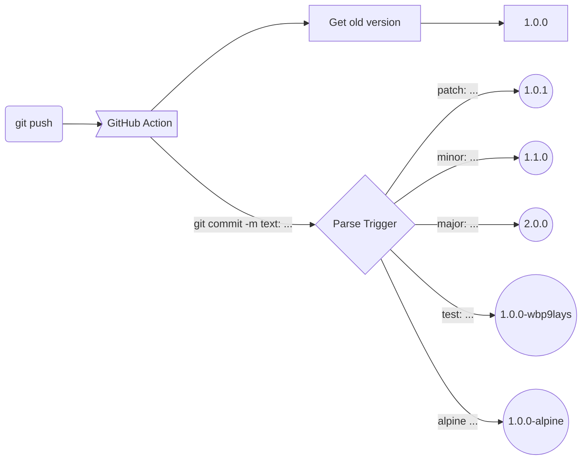

<div align="center">
  <h1>Generic Semantic Version</h1>
  
  
   
   
   
</div>

<br>

This GitHub Action can be used to generate a semantic version. Usefull to create automatic tag/release or any other version. 
It's based on the semantic versioning standard X.Y.Z  and conventional commits.

<br>
<div align="center"></div>
<br>

- Semantic version will be created from particular text in the commit. (major:  minor:, patch:, fix: and more...).
- This action enable you to use your own way to obtain a tag or version.
- You can use local files and parse it, or even parse a dockerhub remote tag.


<br>

### Triggers 

```
git commit -m "fix:  bla bla bla"
                |      |
                |      |__ Subject
                |_________ Trigger
```


<br><br><br>

<div align="center">
  
### Description

|type       | messajes and/or triggers                      |description                                                                                                               | 
|---        |---                                            |---                                                                                                                       |
|breaking:  |major:, breaking:, release:                    | When you make incompatible API changes or add big changes that can be broken or can be "incompatible" with old versions  |
|update:    |minor:, enhancement:, update:, small-feature:  |When create a new implementation, without breaking changes (...here you don't break anything)                             |
|fix:       |patch:, fix:, feat:                            |This is a patch or small fix, in general could be small bugs or features                                                  |
|tests:     |test:                                          |Used to create new images. Using it, you are sure is only for testing some things (like vulnerability scans or similar)   |
|trash:     |trash:                                         |Temporary use to create a new version that is assumed to be deleted in the future.                                        |
|free:      |my_name:                                       |Free string to use as you like or need  (use only first word)                                                             | 


<br><br>


### Examples

| Command                             | Old version | Patron                     | New version (result)| 
|---                                  |---          |---                         |---                  |
|git commit -m "breaking: text here"  |1.0.0        |[+1].Y.Z                    |2.0.0                |
|git commit -m "update: text here"    |1.0.0        |X.[+1].Z                    |1.1.0                |
|git commit -m "fix: text here"       |1.0.0        |X.Y.[+1]                    |1.0.1                |
|git commit -m "test: text here"      |1.0.0        |X.Y.Z-[random-string]       |1.0.0-eps2p7o1       |
|git commit -m "trash: text here"     |1.0.0        |X.Y.Z_trash-[random-string] |1.0.1_trash-6djf7mk1 |
|git commit -m "my_name: text here"   |1.0.0        |X.Y.Z-[first-word]          |1.0.0-my_name        |

<br><br>


### Logic


</div>
<br>

### Use example:

```yaml
      - uses: jpradoar/ga-semanticversion@v1.0.0
        with:
          COMMIT_MSG:  ${{ github.event.head_commit.message }}
          VERSION: ${{ steps.last_version_local_file.outputs.LAST_VERSION }}
```

<br>

### Required inputs in the action:
- <b>VERSION</b>: This input wait for a version number. You can use your own comand here. 
- <b>COMMIT_MSG</b>: This input get the commit text and use it to generate new version.

<br>


  


### Example-Action (with local json file)
```yaml
name: Semantic-Version
on:
  push:
    branches: [ main ]
  pull_request:
    branches: [ main ]
jobs:
  Semantic-Version:
    runs-on: ubuntu-latest
    steps:
      - name: Checkout del repositorio
        uses: actions/checkout@v3        
      
      - name: Get las version of local file
        id: last_version_local_file
        run: |
          LastVersion=$(cat version-example.json |jq -r .version)
          echo "LAST_VERSION=$LastVersion " >> "$GITHUB_OUTPUT"
      
      - name: Generate new version with local file
        uses: jpradoar/ga-semanticversion@v1.0.0
        with:
          COMMIT_MSG:  ${{ github.event.head_commit.message }}
          VERSION: ${{ steps.last_version_local_file.outputs.LAST_VERSION }}
```

<br>

### Example-Action (with dockerhub)
```yaml
name: Semantic-Version
on:
  push:
    branches: [ main ]
  pull_request:
    branches: [ main ]

env:
  REPO_APP: 'ga-semanticversion'

jobs:
  Semantic-Version:
    runs-on: ubuntu-latest

    steps:
      - name: Checkout del repositorio
        uses: actions/checkout@v3        

      - name: Get last version of docker-hub image
        id: last_version_remote_file
        run: |
          LastVersion=$(curl -s "https://hub.docker.com/v2/repositories/jpradoar/${{ env.REPO_APP }}/tags/?page_size=2" | jq -r '.results[].name'|sort -M|grep -v latest|tail -1)
          echo "LAST_VERSION=$LastVersion " >> "$GITHUB_OUTPUT"

      - name: Generate new version with semantic version
        id: nversion
        uses: jpradoar/ga-semanticversion@v1.0.0
        with:
          COMMIT_MSG:  ${{ github.event.head_commit.message }}
          VERSION: ${{ steps.last_version_remote_file.outputs.LAST_VERSION }}

      - name: Show new version
        run: echo "New version ${{ steps.nversion.outputs.NEW_VERSION }}" 
```

<br>

### License 
The scripts and documentation in this project are released under the [MIT License](./LICENSE).

<br>

### Contributing and Support
All kinds of contributions are welcome ❤️ Please feel free to [create GitHub issues,PR](https://github.com/jpradoar/ga-semanticversion) for any feature requests, bugs, or documentation problems.


<br>

### Refs

 * [https://semver.org/](https://semver.org/)
 * [https://www.conventionalcommits.org/](https://www.conventionalcommits.org/)
